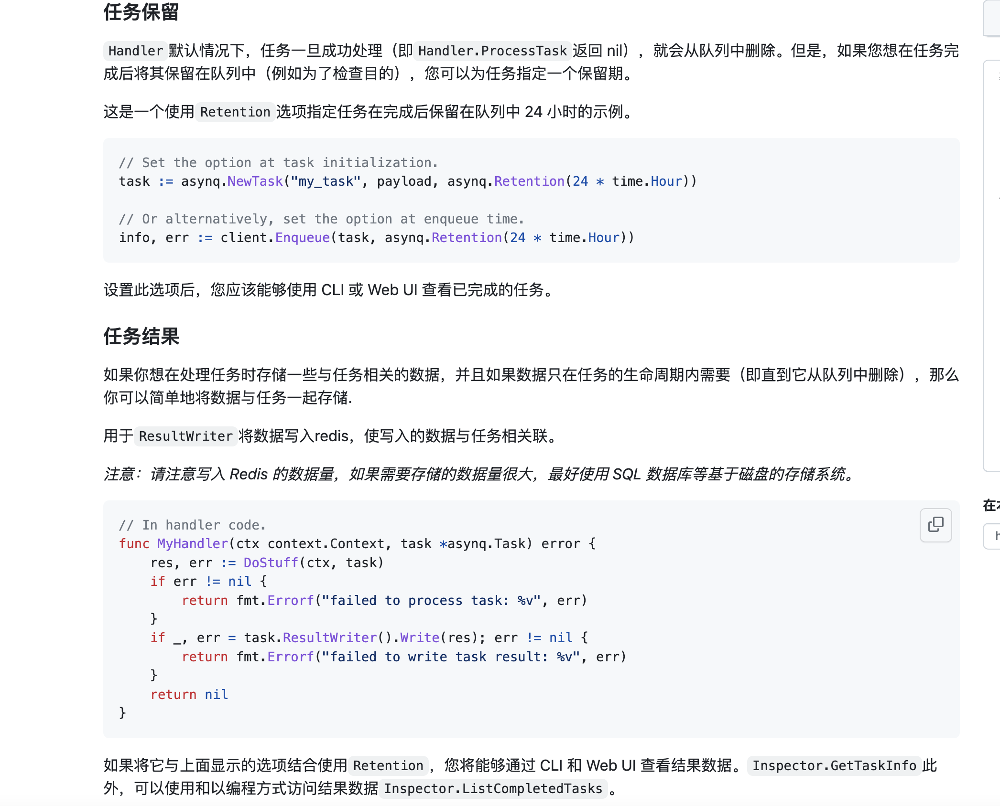

# 1. 地址

```
client
https://github.com/hibiken/asynq.git
```


# 2 客户端创建任务

```
package main

import (
	"encoding/json"
	"github.com/hibiken/asynq"
	"log"
	"time"
)

type EmailTaskPayload struct {
	// ID for the email recipient.
	UserID int
}

// client.go
func main() {
	client := asynq.NewClient(asynq.RedisClientOpt{Addr: "localhost:6379"})

	// Create a task with typename and payload.
	payload, err := json.Marshal(EmailTaskPayload{UserID: 42})
	if err != nil {
		log.Fatal(err)
	}
	t1 := asynq.NewTask("email:welcome", payload)

	t2 := asynq.NewTask("email:reminder", payload)

	// Process the task immediately.
	info, err := client.Enqueue(t1)
	if err != nil {
		log.Fatal(err)
	}
	log.Printf(" [*] Successfully enqueued task: %+v", info)

	// Process the task 24 hours later.
	info, err = client.Enqueue(t2, asynq.ProcessIn(24*time.Hour))
	if err != nil {
		log.Fatal(err)
	}
	log.Printf(" [*] Successfully enqueued task: %+v", info)
}


```


# 3 服务端消费

```
package main

import (
	"context"
	"encoding/json"
	"fmt"
	"github.com/hibiken/asynq"
	"log"
)

type EmailTaskPayloads struct {
	// ID for the email recipient.
	UserID int
}

// workers.go
func main() {
	srv := asynq.NewServer(
		asynq.RedisClientOpt{Addr: "localhost:6379"},
		asynq.Config{Concurrency: 10},
	)
	// NOTE: We'll cover what this `handler` is in the section below.
	if err := srv.Run(asynq.HandlerFunc(handler)); err != nil {
		log.Fatal(err)
	}
}

func handler(ctx context.Context, t *asynq.Task) error {
	switch t.Type() {
	case "email:welcome":
		var p EmailTaskPayloads
		if err := json.Unmarshal(t.Payload(), &p); err != nil {
			return err
		}
		log.Printf(" [*] Send Welcome Email to User %d", p.UserID)

	case "email:reminder":
		var p EmailTaskPayloads
		if err := json.Unmarshal(t.Payload(), &p); err != nil {
			return err
		}
		log.Printf(" [*] Send Reminder Email to User %d", p.UserID)

	default:
		return fmt.Errorf("unexpected task type: %s", t.Type())
	}
	return nil
}

```

# 4 匹配模式进行消费

```
package main

import (
	"context"
	"encoding/json"
	"github.com/hibiken/asynq"
	"log"
)

type EmailTaskPayloads struct {
	// ID for the email recipient.
	UserID int
}

// workers.go
func main() {
	srv := asynq.NewServer(
		asynq.RedisClientOpt{Addr: "localhost:6379"},
		asynq.Config{Concurrency: 10},
	)

	mux := asynq.NewServeMux()
	mux.HandleFunc("email:welcome", sendWelcomeEmail)
	mux.HandleFunc("email:reminder", sendReminderEmail)

	if err := srv.Run(mux); err != nil {
		log.Fatal(err)
	}
}

func sendWelcomeEmail(ctx context.Context, t *asynq.Task) error {
	var p EmailTaskPayloads
	if err := json.Unmarshal(t.Payload(), &p); err != nil {
		return err
	}
	log.Printf(" [*] Send Welcome Email to User %d", p.UserID)
	return nil
}

func sendReminderEmail(ctx context.Context, t *asynq.Task) error {
	var p EmailTaskPayloads
	if err := json.Unmarshal(t.Payload(), &p); err != nil {
		return err
	}
	log.Printf(" [*] Send Reminder Email to User %d", p.UserID)
	return nil
}

```

# 5 文档

[开始文档](https://github.com/hibiken/asynq/wiki/Getting-Started)


# 6 任务结果保留




